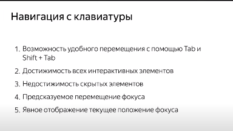

A11Yy

1.  alt
2.  aria-hidden="true" - для картинок які не несуть ніякої інформації
3.  <label>
4.  <input="number">
    <input="email">
    <input="range">
    <input="color">
    <input="url">
    <input="date">
    <input="checkbox">
    <input="password">
    <input="radio">
    <input="search">
    <input="tel">
5.  <fieldset>
    <legend>
6.  Виводити повідомлення про помилки і успіх
7.  <title>
8.  <lng>
9.  Валідатор
10. Симантика
    Мають бути заголовки
    <nav><ul><li></li></ul></nav>

11. Кнопка:
    -можна сфокусувати;
    -є стан disabled;
    -Клік проходить також через нажимання на Enter і Space-
    -правильна роль
12. Елементи мають бути контрстними і відрвзняємі.
13. Шрифти читаємі
14. Область кліка більша ніж візуальна область контролаю
15. Область кліка не тільки надпись, але і весь блок.
16. Важливі кнопки подалі один від одного.
17. Дизайн має бути логічним, передбачувальним, одноманітний
18. tabindex=0
    accesskey
19. focus ring має бути
    focus-visible
    невипадати з фокуса одального вікна
    WCAG КРИТЕРІЇ
